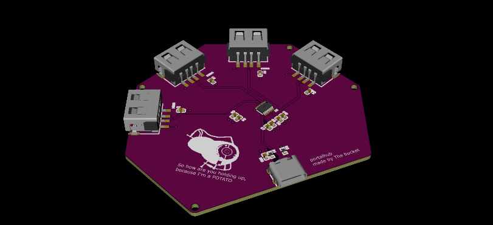
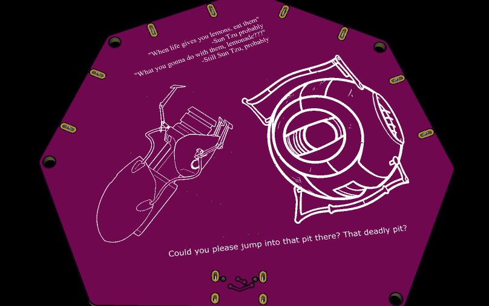
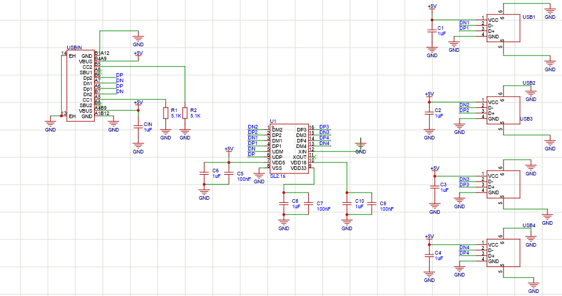
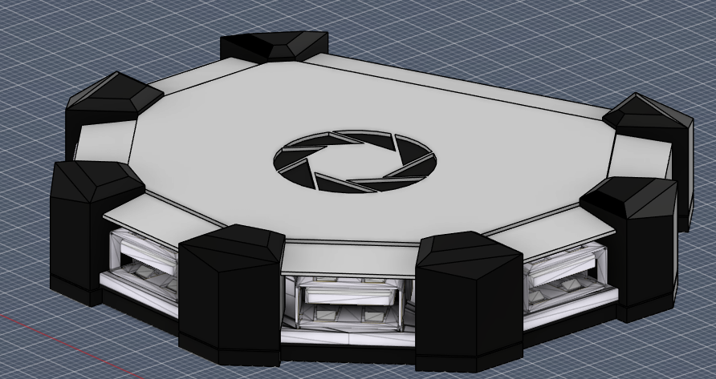

# Portalusbhub
This is a usb hub that lets you connect 4 usbs inspired by portal
The repository is structured as follows:

 - CAD: with the models for the casing of the hub in various formats
 - PCB: with the schematics for the pcb in epro and kicad + gerber

## PCB
Here is the pcb plus its schematic:

## BOM
The BOM is as follows:
* 4 usb-A 2.0 connectors
* 1 usb-c connector
* 1 CoreChips SL2.1s
* 2 resistors 5.1k
* 8 condensers 1uF
* 3 condensers 100nF

## CASE
And here's the case i made for the hub, it has a top side and a bottom one:

